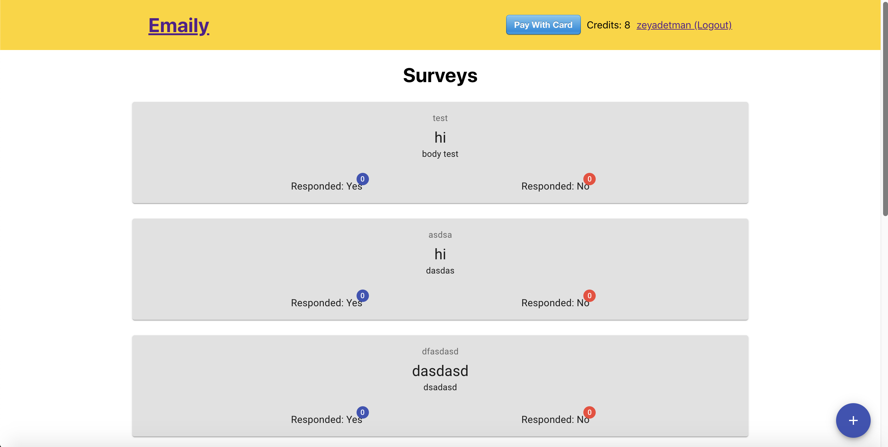

# Emaily

Sends emails to clients and recieve their responds.

_[The server side code for this project here.](https://github.com/zeyadetman/emaily-server)_

## Screenshot

## How to run the app?

1. `yarn`.
2. Create a `.env` file from the `.env.example` file.
3. Go to [Stripe](https://stripe.com/) and signup to get the publish key, then set the env `REACT_APP_STRIPE_PUBLISH_KEY` with it.
4. After Running [the server side project](https://github.com/zeyadetman/emaily-server), set the `REACT_APP_API_URL` env with the corresponding url.
5. `yarn start`
